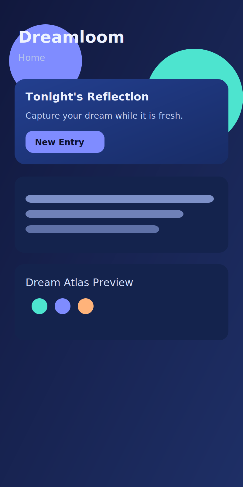
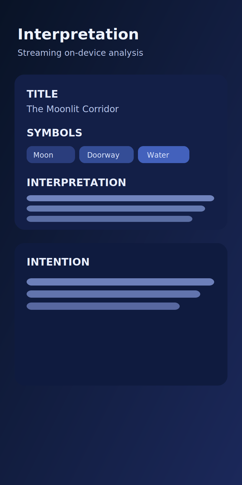
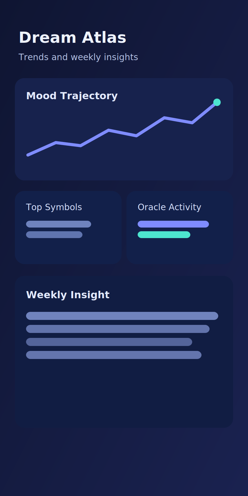

# Dreamloom

**Your dreams, decoded. Privately.**

Dreamloom is an Android dream journal. You record or type your dream, and on-device AI (Gemma through LiteRT-LM) helps interpret themes and symbols. **Your entries stay on your phone**—no account, no cloud sync. An optional one-time download brings the model onto the device; after that, core journaling works offline.

## Privacy

Journaling and interpretation are processed locally. Network use is limited to what you would expect: first-time model download, optional crash and usage analytics (with controls in the app), and ads if you use the ad-supported build. See the in-app privacy information and, when published, the privacy policy linked from the store listing.

## Get the app

Install from **Google Play** when the listing is live.

Until then, use the automatic build releases:

- **Download page:** [Dreamloom Downloads](https://chartmann1590.github.io/dreamloom/)
- **All CI releases:** [GitHub Releases](https://github.com/chartmann1590/dreamloom/releases)

Every push triggers a workflow that publishes:

- `app-release.apk`
- `app-release.aab`

The workflow requires these GitHub repository secrets:

- `DREAMLOOM_MODEL_SHA256`
- `ANDROID_KEYSTORE_B64` (base64 of your release keystore)
- `ANDROID_KEYSTORE_PASSWORD`
- `ANDROID_KEY_ALIAS`
- `ANDROID_KEY_PASSWORD`

Release versioning is automatic in CI:

- `versionCode = github.run_number` (always increases)
- `versionName = 0.1.<github.run_number>`

## Screenshots

## Build from source

You need [Android Studio](https://developer.android.com/studio) (recommended) or the Android command-line tools, plus **JDK 17**.

1. Clone this repository.
2. Open the project root in Android Studio and let it sync Gradle.
3. Ensure `local.properties` exists in the project root with `sdk.dir=`<path to your Android SDK> (Android Studio usually creates this).
4. Run the `app` run configuration on a device or emulator.

A release build also needs your own Firebase project, AdMob configuration, signing setup, and hosted model URLs. See [SETUP.md](SETUP.md) for that checklist.
