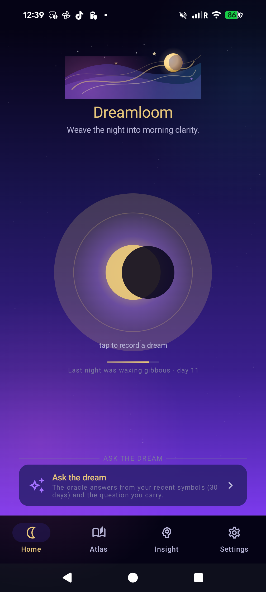
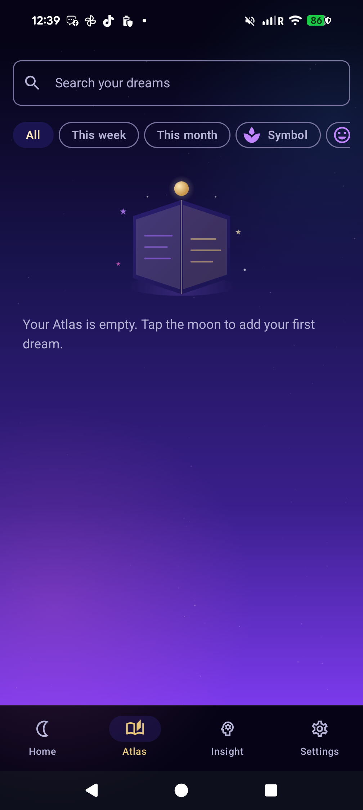
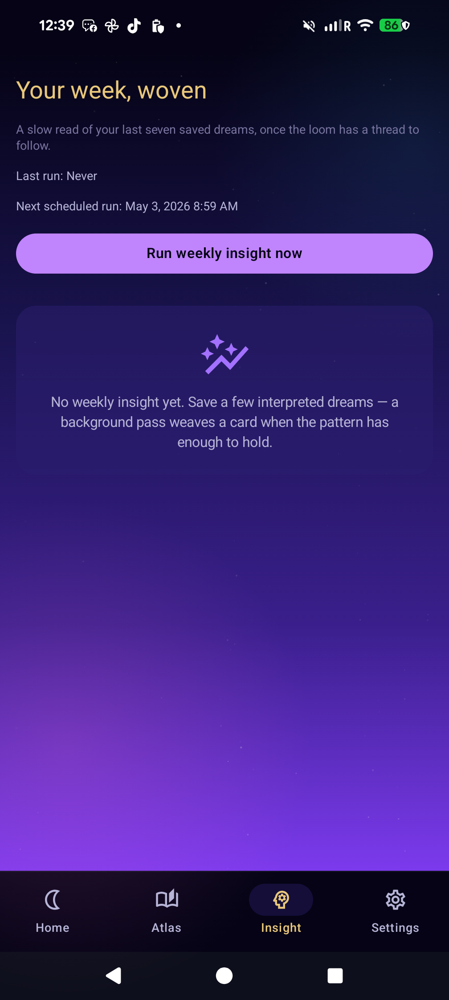

<div align="center">



# Dreamloom

### Your dreams, decoded — privately.

**A mystical Android dream journal powered by on-device AI.** Capture dreams by voice or text, and Gemma — running locally through LiteRT‑LM — interprets your symbols, themes, and emotional weather. Nothing about your dreams ever leaves your phone.

[](#)
[](#)
[](#)
[](#)
[](#)
[](https://github.com/chartmann1590/dreamloom/releases/latest)
[](https://github.com/chartmann1590/dreamloom/actions/workflows/release-and-site.yml)

[**🌐 Website**](https://chartmann1590.github.io/dreamloom/) ·
[**⬇️ Download**](https://chartmann1590.github.io/dreamloom/) ·
[**📜 Privacy Policy**](https://chartmann1590.github.io/dreamloom/privacy.html) ·
[**📦 All Releases**](https://github.com/chartmann1590/dreamloom/releases)

</div>

---

## ✨ Why Dreamloom

> *"Dreams are letters from the deep mind. Dreamloom helps you read them — without sending them anywhere."*

|   | Feature | What it means |
|---|---------|---------------|
| 🔒 | **100% on‑device AI** | Gemma runs locally via LiteRT‑LM. Your dream text is never uploaded. |
| 🌙 | **Voice or text capture** | Whisper your dream the moment you wake. Auto‑transcribed, instantly. |
| 🪞 | **Symbol + theme decoding** | Title, symbols, interpretation, and an intention for the day. |
| 🗺️ | **Dream Atlas** | Search, filter, and explore every entry by symbol, mood, or week. |
| 📈 | **Weekly Insights** | Recurring patterns surfaced from your own history — locally. |
| 🔮 | **Dream Oracle** | Ask follow‑up questions about your dream world, on‑device. |
| 🛡️ | **Encrypted by default** | Room + SQLCipher. Even on your phone the journal is at‑rest encrypted. |
| 💤 | **Works offline** | One‑time model download, then journaling has no network requirement. |

---

## 📸 Screens

<table>
  <tr>
    <td align="center"><br/><sub><b>Home — moonlit capture</b></sub></td>
    <td align="center"><br/><sub><b>Atlas — your symbol map</b></sub></td>
    <td align="center"><br/><sub><b>Insight — weekly patterns</b></sub></td>
  </tr>
</table>

<p align="center"><sub>📽️ <a href="docs/assets/video/promo_video_voiceover_burned_v2.mp4">Watch the promo</a> · 🌐 <a href="https://chartmann1590.github.io/dreamloom/">Live site</a></sub></p>

---

## 🔐 Privacy at a glance

- **Dream content is local.** Your entries live in an encrypted Room database (SQLCipher) and app‑internal storage.
- **No account.** No sign‑up, no cloud sync, no profile.
- **Network is minimal.** Used only for the first‑time model download, ads, and (opt‑out) Firebase analytics & Crashlytics.
- **Ads are contextual, not behavioral on your dream content.** Ad text/audio/video never sees your journal.
- **Read the full policy:** [chartmann1590.github.io/dreamloom/privacy.html](https://chartmann1590.github.io/dreamloom/privacy.html)

---

## ⬇️ Get the app

| Channel | Status |
|---|---|
| 🟢 **Download website** | [chartmann1590.github.io/dreamloom](https://chartmann1590.github.io/dreamloom/) |
| 📦 **GitHub Releases (APK + AAB)** | [Releases](https://github.com/chartmann1590/dreamloom/releases) |
| 🛒 **Google Play** | *Listing in progress* |

Every push to a branch triggers a CI build that produces a **signed `app-release.apk`** and **signed `app-release.aab`**, ready for the Play Console:

- `versionCode` is auto‑bumped to `github.run_number`
- `versionName` is `0.1.<github.run_number>`
- Builds are **shrunk + obfuscated** (R8 / ProGuard) and **signed** with the configured keystore
- Ads (AdMob + UMP + Meta/AppLovin mediation) are wired and enabled in release

### Required GitHub Secrets

| Secret | Purpose |
|---|---|
| `DREAMLOOM_MODEL_SHA256` | SHA‑256 of `gemma-4-E2B-it-int4.litertlm` (verified at download time) |
| `ANDROID_KEYSTORE_B64` | Base64 of the upload keystore (`base64 -w0 release.keystore`) |
| `ANDROID_KEYSTORE_PASSWORD` | Keystore password |
| `ANDROID_KEY_ALIAS` | Key alias inside the keystore |
| `ANDROID_KEY_PASSWORD` | Key password |

---

## 🏗️ Architecture (one paragraph)

Single‑module, **single‑activity Compose** app with **Hilt** DI and **MVVM** flow: `Compose UI → ViewModel(StateFlow<UiState>) → Repository → DAO/Engine/DataStore`. The `LlmEngine` is an application‑scoped singleton that owns one LiteRT‑LM `Engine` and runs all generation on a single‑threaded dispatcher. Backend is auto‑selected: **NPU (Hexagon) → GPU (OpenCL) → CPU**. Persistence is **Room over SQLCipher**; the passphrase is held in the Android Keystore via EncryptedSharedPreferences. Ads use Google Mobile Ads (AdMob) with UMP consent and Meta/AppLovin mediation. Telemetry is **opt‑out** Firebase Analytics + Crashlytics, and never includes dream content.

For more depth see [`tech/ARCHITECTURE.md`](tech/ARCHITECTURE.md), [`tech/GEMMA_INTEGRATION.md`](tech/GEMMA_INTEGRATION.md), and [`tech/MODEL_DOWNLOAD.md`](tech/MODEL_DOWNLOAD.md).

---

## 🔧 Build from source

You need **JDK 17**, the Android SDK (compileSdk 35, minSdk 28), and either Android Studio or the command‑line tools.

```bash
# Clone + sync
git clone https://github.com/chartmann1590/dreamloom.git
cd dreamloom

# Local debug build & install
./gradlew :app:installDebug

# Tests
./gradlew :app:testDebugUnitTest
./gradlew :app:lintDebug

# Signed release (requires dreamloom.modelSha256 + signing properties in local.properties)
./gradlew :app:assembleRelease :app:bundleRelease
```

Release builds **fail fast** unless `dreamloom.modelSha256` is set in `local.properties` (or `-Pdreamloom.modelSha256=...`). See [`SETUP.md`](SETUP.md) for the full release checklist (Firebase, AdMob, signing, model hosting).

---

## 🧭 Project layout

```
app/src/main/java/com/charles/app/dreamloom/
├── DreamloomApplication.kt   # @HiltAndroidApp, Firebase + AdMob init, schedulers
├── MainActivity.kt           # Single activity host, deep-link route handoff
├── ui/                       # Compose root + AppNavHost
├── feature/                  # onboarding · home · newdream · detail · atlas · insight · oracle · settings
├── data/                     # Room (SQLCipher), DataStore prefs, repositories
├── llm/                      # LiteRT-LM engine, prompts, parsers, backend detect
├── ads/                      # AdGate, AppOpen / Interstitial / Rewarded / Native managers
├── work/                     # Model download, weekly insight, reminders (WorkManager)
├── telemetry/                # Firebase analytics + crashlytics gating
└── di/                       # Hilt modules
```

---

## 🤝 Contributing

Issues and PRs welcome. Before opening a PR, please:

1. Run `./gradlew :app:testDebugUnitTest` and `./gradlew :app:lintDebug`
2. Keep dream content out of analytics — see `INSTRUCTIONS.md`
3. Don't break the privacy invariants enforced by `BrandPromiseInstrumentedTest`

---

<div align="center">
  <sub>Built with ✨ Compose, ☁️ Hilt, 🔒 SQLCipher, and a locally‑hosted Gemma. Designed to feel like the dream itself.</sub>
</div>
